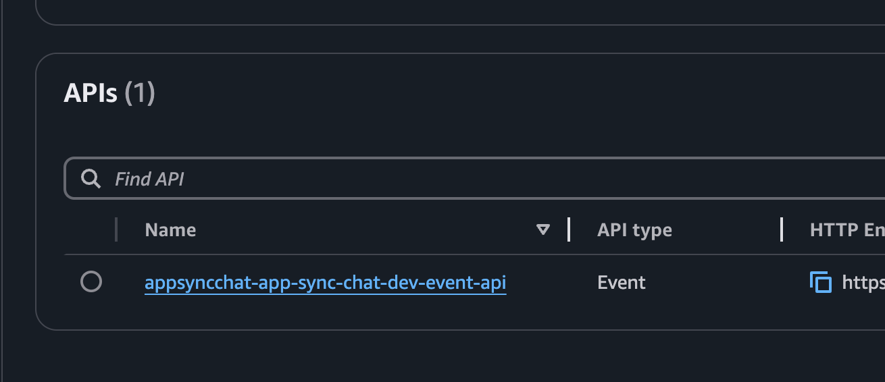
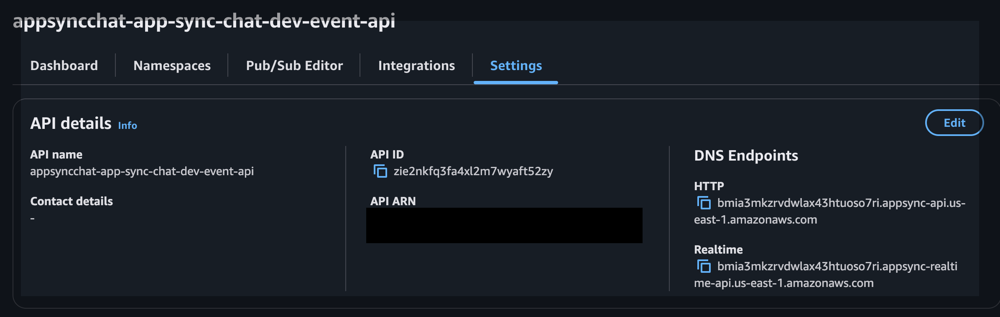
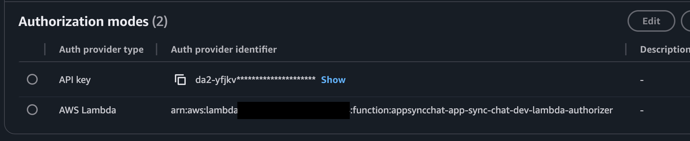
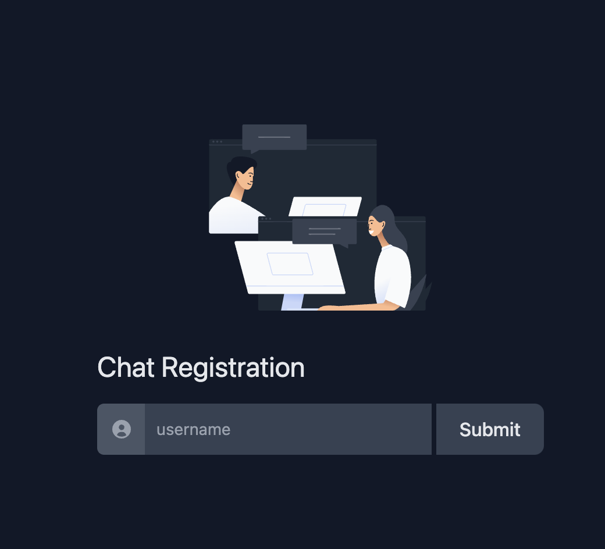
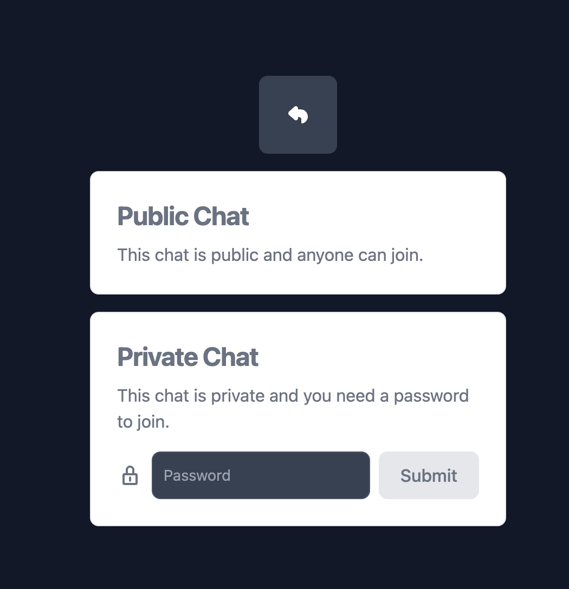
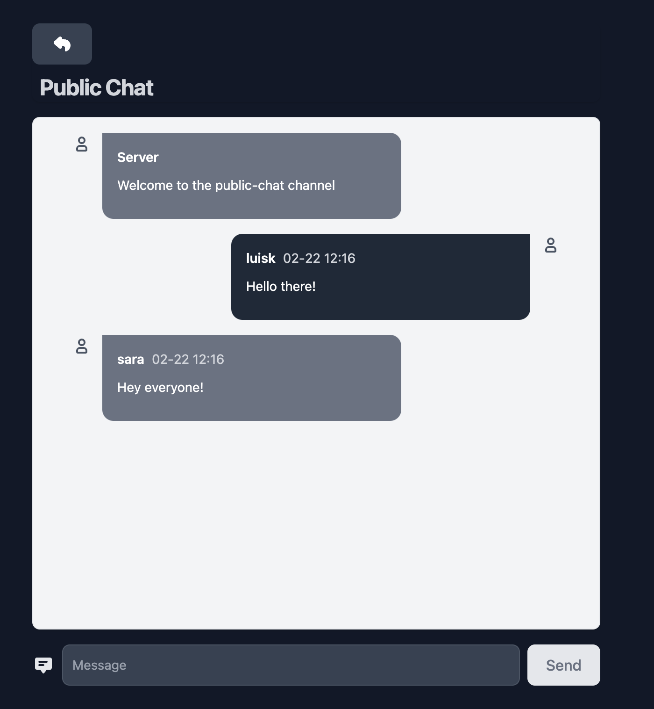

# App Sync Chat

> @author: [Luis Carlos Osorio Jayk](https://www.linkedin.com/in/luiscarlososoriojayk)

## Context

> AWS AppSync announced AWS AppSync Events, a feature that lets developers easily broadcast real-time event data to a few or millions of subscribers using secure and performant serverless WebSocket APIs. With AWS AppSync Events, developers no longer have to worry about building WebSocket infrastructure, managing connection state, and implementing fan-out. Developers simply create their API, and publish events that are broadcast to clients subscribed over a WebSocket connection. AWS AppSync Event APIs are serverless, so you can get started quickly, your APIs automatically scale, and you only pay for what you use. In this blog, I’ll discuss AWS AppSync Events, describe what AWS AppSync Event APIs are, and show you how you can get started.

## Refrences
- [AWS AppSync Events](https://docs.aws.amazon.com/appsync/latest/eventapi/event-api-welcome.html)
- [Announcing AWS AppSync Events: Serverless WebSocket APIs](https://aws.amazon.com/blogs/mobile/announcing-aws-appsync-events-serverless-websocket-apis/)


## This project

This project is a simple chat application that allows you to chat with your friends. It uses AWS AppSync Events to broadcast messages to all connected clients.

It is split into two namespaces, one public and one private which requires knowing the password, which leverages in Lambda authorizer to allow or disallow subscription and publishing to the private namespace.

## How to deploy

It uses [AWS CDK](https://aws.amazon.com/cdk) to deploy the infrastructure.

Since the client is a static site and will require to set some **VITE** environment variables that will only exist once the EventAPI is deployed, we will need to do a multi-step process to deploy first, the EventAPI within the **StatelessStack**, and then use some of the values generated there to populate the **VITE** environment variables in the `src/client/.env` file, and finally deploy the infrastructure for the client in the **StatefulStack** which is a static site.

I've split the infrastructure into two stacks, just for convenience, so you can deploy or destroy one or the other, independently.

### Step 1: Clone the repository

```bash
git clone https://github.com/aws-samples/app-sync-chat.git
```

### Step 2: Install CDK dependencies and deploy the EventAPI

First we need to create an .env file in the `cdk` folder with the following variables:

```bash
DOMAIN=your-domain # e.g. example.com (optional)
SUBDOMAIN=your-subdomain # e.g. chat (optional)
ENV_NAME=dev # e.g. dev | staging | prod (required)
```

You can take the `cdk/.env.example` file as a reference.

The `DOMAIN` and `SUBDOMAIN` are optional, but if you want to deploy the client to a custom domain, you will need to set them.
Otherwise, the client will be available at the CloudFront distribution domain provided by AWS.

The `ENV_NAME` is required, and it will be used to name the resources, so it can be used to differentiate between environments.
Then we can now deploy the EventAPI.

🚀 Now we can deploy the EventAPI 

```bash
cd app-sync-chat/cdk
npm install
npm run cdk:deploy:stateless
```

Once deployed, you can find the API at the AppSync service in the AWS console.

#### AppSync Event APIs:


Once inside the API, under the **settings** tab, you can find the endpoints for the HTTP and the Realtime subscriptions, as well as the APIKey (scrolling down in the same page) that we will need to populate the **VITE** environment variables in the next step.

#### Endpoints:


#### API Key:


### Step 3: Populate the VITE environment variables

Once you have the endpoints and the API Key, you can populate the **VITE** environment variables in the `src/client/.env` file. You can take the `src/client/.env.example` file as a reference.

```bash
cd app-sync-chat/src/client
cp .env.example .env
```

There you will see some variables that need to be populated, the most important ones are the `VITE_HTTP_ENDPOINT` and the `VITE_REALTIME_ENDPOINT`, and `VITE_API_KEY`, which you can get from the outputs of the `StatelessStack` deployment.

### Step 4: Build the client

🏗️ With the environment variables populated, we can now build the client.

```bash
cd app-sync-chat/src/client
npm install
npm run build
```

This will build the client and create a `src/client/dist` folder with the static site.

### Step 5: Deploy the client

🚀 Now we can deploy the client

```bash
cd app-sync-chat/cdk
npm install
npm run cdk:deploy:stateful
```

## How it works

Once all the resources are deployed, you can start to use the chat.

### First screen: Chat Registration

In this screen, you will need to register a username to start to chat.



### Secon screen: Chat room selection

Once you have registered, you will be redirected to the chat room selection screen, where you can select a chat room to join.

Notice that the public chat room doesn't require a password, but the private ones do.

You can change it in the `cdk/lib/config/dev.ts`, in the `authorizationToken` variable. This is the token that will be used to authorize the private chat rooms per environment.



### Third screen: Chat Room

Once you have selected a chat room, you will be redirected to the chat room screen, where you can send messages to the chat room.



## What's the deal?

🙂 `It's elegantly simple!`

The big win with AWS AppSync EventAPIs is that you don't need to worry about the WebSocket infrastructure, managing connection state, and implementing fan-out.

You just create your API, and publish events that are broadcast to clients subscribed over a WebSocket connection.

It supports a wildcard subscription, so you can subscribe to all events in a namespace.

And in regards to authorization, it supports:
- API Key authorization
- Lambda authorization
- IAM authorization
- OpenID Connect authorization
- Amazon Cognito user pools

There are no external dependencies required to connect to your API in a web browser. The JavaScript code snippet below shows how you can connect to your endpoint using the browser’s Web API WebSocket.

```js
const REALTIME_DOMAIN = ''
const HTTP_DOMAIN = ''
const API_KEY = ''

const authorization = { 'x-api-key': API_KEY, host: HTTP_DOMAIN }

function getAuthProtocol() {
  const header = btoa(JSON.stringify(authorization))
    .replace(/\+/g, '-') // Convert '+' to '-'
    .replace(/\//g, '_') // Convert '/' to '_'
    .replace(/=+$/, '') // Remove padding `=`
  return `header-${header}`
}

const socket = await new Promise((resolve, reject) => {
  const socket = new WebSocket(
    `wss://${REALTIME_DOMAIN}/event/realtime`,
    ['aws-appsync-event-ws', getAuthProtocol()])
  socket.onopen = () => {
    socket.send(JSON.stringify({ type: 'connection_init' }))
    resolve(socket)
  }
  socket.onclose = (evt) => reject(new Error(evt.reason))
  socket.onmessage = (event) => console.log('=>', JSON.parse(event.data))
})

socket.send(JSON.stringify({
  type: 'subscribe',
  id: crypto.randomUUID(),
  channel: '/default/*',
  authorization
})) 
```

You can send events by using your browser’s Web API fetch method. For example, run the following in the developer console.

```js
const event = {
  "channel": "/default/introductions",
  "events": [
    JSON.stringify({message:'Hello World! Introducing AWS AppSync Events!'})
  ]
}

const response = await fetch(`https://${HTTP_DOMAIN}/event`, {
  method: 'POST',
  headers: authorization,
  body: JSON.stringify(event)
})

console.log(response)
```

## ⭐️ Seamless Integration with EventBridge (Event Driven Architecture)

With Amazon EventBridge, you can configure an API destination to forward events to AWS AppSync Event API HTTPS endpoint.

Which allows you to integrate with other AWS services, such as AWS Lambda, Amazon SNS, Amazon SQS, and more.